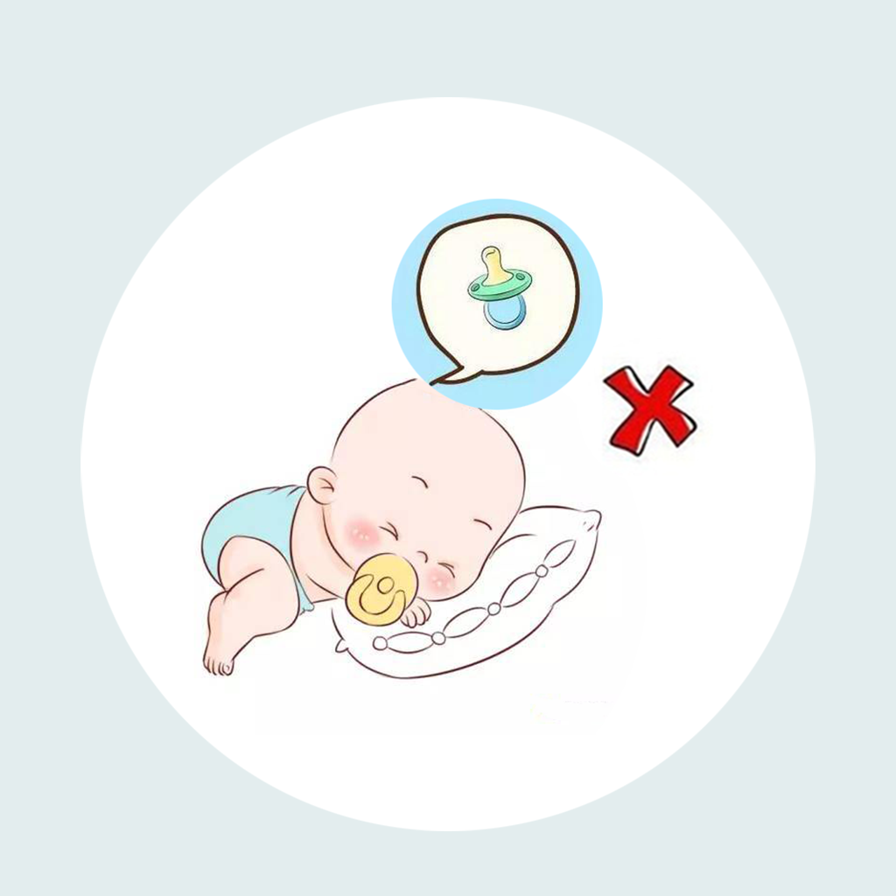

## Welcome to Baby Use Pacifier Posture Record

Babies in every family often encounter the use of pacifiers. When the baby uses the pacifier incorrectly, it can easily cause a series of problems that affect the baby's development and physical health. For example, when a baby is using a pacifier, he likes to sleep on his stomach, which causes the baby to breathe less smoothly. We, as parents, should be more careful to protect our babies. We can record some of the babies pacifiers wrong postures and information, such as babies pacifiers model, time, posture, and feelings. In this way, we can better help the baby use the pacifier posture correctly, and help the baby grow up healthy.

If you have any questions, you can either leave a message or send the questions to our email address.

We will answer them for you in the first time.

### Address: jichungan9498@163.com

Thank you!
